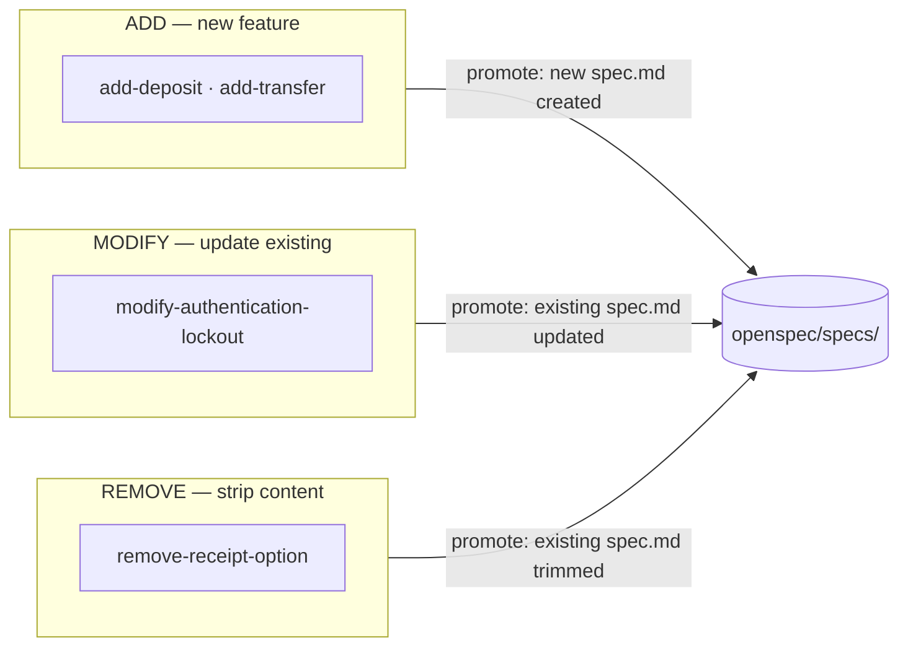
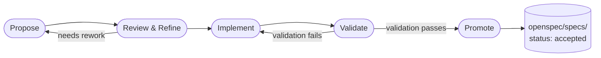
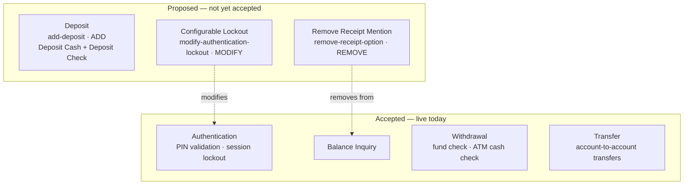
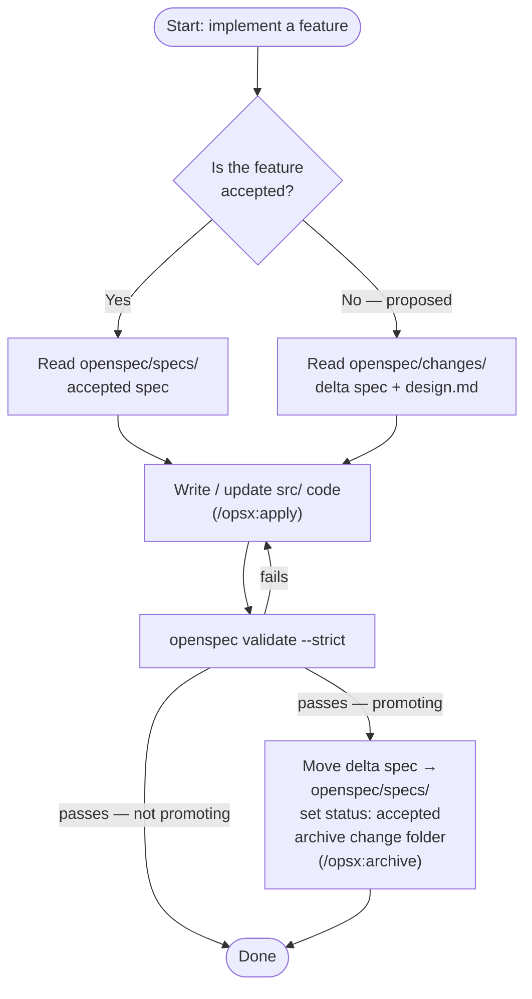
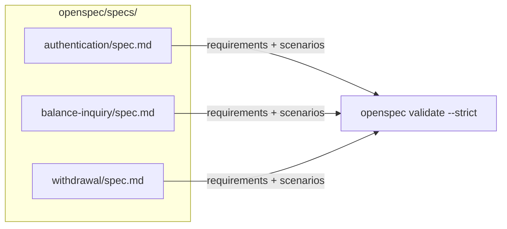
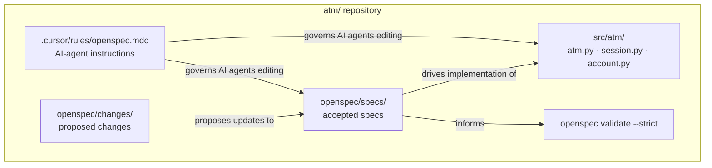

# ATM OpenSpec Demo

A minimal Python project that demonstrates **OpenSpec** concepts using a simple ATM machine
as the domain. The terminal application is intentionally *not* the focus — the goal is to
show how OpenSpec organises specs, changes, delta specs, and scenarios, and how specifications
drive both implementation and validation.


## Introductory Video

▶️ **[Download/watch the introductory video](https://github.com/clawaimax/openspec-atm/raw/refs/heads/main/assets/intro-video.mp4)**


---

## Table of Contents

1. [What is OpenSpec?](#1-what-is-openspec)
2. [The OpenSpec Workflow](#2-the-openspec-workflow)
3. [How This ATM Project Maps to OpenSpec](#3-how-this-atm-project-maps-to-openspec)
4. [How to Read the Project](#4-how-to-read-the-project)
5. [Example Walkthroughs](#5-example-walkthroughs)
6. [Cursor and AI-Agent Usage](#6-cursor-and-ai-agent-usage)
7. [Validation](#7-validation)
8. [Project Layout](#8-project-layout)

---

## 1. What is OpenSpec?

OpenSpec is a lightweight convention for managing **behavioural specifications** alongside
code. The core idea is simple:

> **Spec = WHAT** the system does
> **Proposal = WHY** the system should change
> **Design = HOW** the change will be implemented

Specs are the source of truth. Changes to behaviour must go through a structured proposal
process before they touch the codebase.

### Specs as the source of truth

A spec describes what a feature does in plain language, using GIVEN / WHEN / THEN scenarios.
Specs live in `openspec/specs/` and are the authoritative description of how the system
behaves right now.

A spec can contain **multiple requirements**, and each requirement can have **multiple
scenarios**. For example, the deposit spec (from the `add-deposit` change) contains two
requirements — **Deposit Cash** and **Deposit Check** — each with its own set of scenarios.
This makes it clear that one spec can specify several related but distinct behaviours.

```
openspec/specs/authentication/spec.md   ← what PIN auth does today
openspec/specs/balance-inquiry/spec.md  ← what balance inquiry does today
openspec/specs/withdrawal/spec.md       ← what withdrawal does today
```

If something is in `openspec/specs/`, it is implemented and validated. If it is not in
`openspec/specs/`, the system does not do it.

### Spec format

Accepted specs follow a simple, consistent structure:

```
# Feature Specification

## Purpose
One-sentence description of the feature.

## Requirements

### Requirement: Name of Requirement
The system SHALL / MUST ...

#### Scenario: Name of Scenario
- GIVEN precondition
- WHEN action
- THEN outcome
- AND additional outcome
```

Each **Requirement** states a binding rule. Each **Scenario** under it illustrates a
specific case with GIVEN / WHEN / THEN / AND steps. One spec, many requirements. One
requirement, many scenarios.

### Changes as proposed updates

A **change** is a folder under `openspec/changes/` that contains a proposal for modifying
the system. A change is not accepted until it has been reviewed, implemented, and promoted.
Until then, the code in `openspec/specs/` remains the truth.

Each change has a type:

| Type | Meaning |
|------|---------|
| `ADD` | Introduces a brand-new spec (new feature) |
| `MODIFY` | Updates an existing accepted spec |
| `REMOVE` | Deletes or strips content from an existing spec |

The diagram below shows how the three change types in this project flow toward `openspec/specs/`
when promoted.



### Delta specs

A **delta spec** is a spec file inside a change folder:

```
openspec/changes/add-deposit/specs/deposit/spec.md
```

A delta spec is *not* accepted. It describes the new or modified behaviour that the change
would introduce *if* it were accepted. It uses the same format as accepted specs, but is
structured as a delta — showing only ADDED, MODIFIED, or REMOVED requirements.

For a MODIFY change, the delta spec shows only what is different. See
`openspec/changes/modify-authentication-lockout/specs/authentication/spec.md` for an example.

### Artifacts

Each change folder contains up to four artifact files:

| File | Purpose |
|------|---------|
| `proposal.md` | **WHY**: what is changing, motivation, and scope |
| `design.md` | **HOW**: optional technical approach, architecture decisions, data flow |
| `tasks.md` | Implementation checklist and promotion steps |
| `specs/<name>/spec.md` | The delta spec — **WHAT** the change introduces |

### Archive / promotion

When a change is accepted:

1. The delta spec is moved (or merged) into `openspec/specs/`.
2. The spec's `status` is updated to `accepted` and the version is bumped.
3. The change folder is archived or removed.

Until that happens, the change folder represents *proposed* work only.

---

## 2. The OpenSpec Workflow

Every behaviour change — whether adding, modifying, or removing a feature — follows the
same five-step lifecycle. The diagram below shows how a proposed change becomes an accepted spec.

> **Quick reference — OpenSpec commands:**
> - `/opsx:propose` — create or refine a proposal and delta spec
> - `/opsx:explore` — review implications and draft a design before implementation
> - `/opsx:apply` — implement or update code according to an accepted or proposed spec
> - `/opsx:archive` — promote an accepted delta spec into `openspec/specs/` and archive the change



### Step 1 — Propose `/opsx:propose`

Someone writes a `proposal.md` describing the change (**WHY**). The proposal states the
type (ADD / MODIFY / REMOVE), the motivation, the scope, and the acceptance criteria.

**ATM example:** `openspec/changes/add-deposit/proposal.md` proposes adding a Deposit
feature. It explains why (users have no way to add funds without a teller) and lists what
changes (`ATM.deposit_cash()` and `ATM.deposit_check()` methods, new spec, new tests).

Use `/opsx:propose` to create or refine a proposal and its delta spec before any code is written.

### Step 2 — Review / refine `/opsx:explore`

The team reviews the proposal, asks questions, and may request changes before any code is
written. During review, a `design.md` is often added to explore the technical approach (**HOW**).

**ATM example:** `openspec/changes/add-deposit/design.md` elaborates on the method
signatures and explains why two separate methods (`deposit_cash`, `deposit_check`) are
clearer than one generic method with a type parameter.

The delta spec is also written or refined here:
`openspec/changes/add-deposit/specs/deposit/spec.md` shows the exact requirements and
scenarios the new feature must satisfy — written in GIVEN/WHEN/THEN form before a line
of code is touched. Notice it contains *two* requirements (Deposit Cash, Deposit Check),
each with multiple scenarios.

Use `/opsx:explore` to review the implications of a proposal, explore edge cases, and
draft or refine the design before implementation begins.

### Step 3 — Implement `/opsx:apply`

With the proposal and delta spec agreed upon, a developer (or AI agent) reads
`tasks.md` to find the implementation checklist and builds the feature. The delta spec
is the implementation contract (**WHAT** must be true) — every scenario must have
corresponding behaviour.

**ATM example:** `openspec/changes/add-deposit/tasks.md` lists:
- Add `ATM.deposit_cash(amount)` and `ATM.deposit_check(amount)` to `src/atm/atm.py`
- Write `tests/test_deposit.py` covering every scenario in the delta spec
- Update README

Use `/opsx:apply` to implement or update code according to an accepted or proposed spec.

### Step 4 — Validate

Run `openspec validate --strict` to verify that every scenario in the delta spec has
a corresponding implementation, and that nothing has been left out. Validation must
pass before a change can be promoted.

```bash
openspec validate --strict
```

This checks that:
- Every requirement in the spec has implementation coverage.
- Every scenario can be traced to a verifiable behaviour.
- No orphaned scenarios exist without a corresponding spec entry.

### Step 5 — Archive / promote `/opsx:archive`

Once all tasks are done and validation passes, the delta spec is moved to `openspec/specs/`,
the `status` is set to `accepted`, and the change folder is removed or archived.

**ATM example (hypothetical):** After add-deposit is accepted:
```
openspec/changes/add-deposit/specs/deposit/spec.md
  → openspec/specs/deposit/spec.md   (status: accepted, version: 1.0.0)

openspec/changes/add-deposit/   ← archived or deleted
```

Use `/opsx:archive` to promote an accepted delta spec into `openspec/specs/` and clean up
the change folder.

---

## 3. How This ATM Project Maps to OpenSpec

### Accepted specs (current truth)

These four specs are accepted. They describe what the ATM does right now.

| Spec | File | What it covers |
|------|------|----------------|
| `authentication` | `openspec/specs/authentication/spec.md` | PIN validation, session lockout |
| `balance-inquiry` | `openspec/specs/balance-inquiry/spec.md` | Checking account balance |
| `withdrawal` | `openspec/specs/withdrawal/spec.md` | Withdrawing cash, fund and ATM-cash checks |
| `transfer` | `openspec/specs/transfer/spec.md` | Account-to-account transfers within the ATM system |

### Proposed changes (not yet accepted)

These three changes are in progress. None of them affect `openspec/specs/` until they are
accepted and promoted.

| Change | Type | What it proposes |
|--------|------|-----------------|
| `add-deposit` | ADD | New Deposit feature — Deposit Cash and Deposit Check requirements, new spec, new tests |
| `modify-authentication-lockout` | MODIFY | Make lockout threshold configurable instead of hard-coded at 3 |
| `remove-receipt-option` | REMOVE | Strip unused receipt mention from the balance-inquiry spec |

The `add-deposit` change is a good illustration of a spec with **multiple requirements**:
the deposit spec covers both **Deposit Cash** and **Deposit Check**, each with its own
scenarios. One spec, two requirements, multiple scenarios each.

The diagram below shows every ATM feature — solid boxes are live today, dashed boxes are
proposed. Arrows show which proposed changes affect which existing specs.



---

## 4. How to Read the Project

### Where to start

1. Read `openspec/openspec.json` — one glance at the project name, specs dir, and changes dir.
2. Read an accepted spec in `openspec/specs/`, such as `openspec/specs/authentication/spec.md`.
   Notice the **Purpose**, **Requirements**, and GIVEN/WHEN/THEN **Scenarios** structure.
3. Compare the scenario names in the spec to the function names in `tests/test_authentication.py`.
   They are intentionally identical (spaces replaced with underscores, lowercased).

### What to inspect next

- Skim the four change folders under `openspec/changes/`. Read each `proposal.md` to
  understand **why** (**WHY**) each change is being made.
- For `add-deposit` and `modify-authentication-lockout`, also read `design.md` — these
  changes needed technical discussion (**HOW**) before implementation.
- Read the delta specs under `openspec/changes/*/specs/`. Each is structured as a delta:
  ADDED, MODIFIED, or REMOVED requirements. ADD delta specs are full requirement lists;
  MODIFY delta specs show only what changes; REMOVE delta specs show what is stripped.
- Notice the `add-deposit` delta spec: it has two requirements — **Deposit Cash** and
  **Deposit Check** — each with multiple scenarios. This illustrates that one spec can
  describe several related behaviours, not just one.

### Spec format at a glance

```
# Feature Specification

## Purpose
One-sentence description.

## Requirements

### Requirement: Descriptive Name
The system SHALL ...

#### Scenario: Descriptive Name
- GIVEN precondition
- WHEN action
- THEN outcome
- AND additional outcome
```

Each **Requirement** is a binding rule (using SHALL / MUST / SHOULD). Each **Scenario**
under it is a concrete GIVEN/WHEN/THEN example. A spec may contain any number of
requirements, and each requirement may have any number of scenarios.

### How scenarios map to validation

Scenario titles in a spec serve as the canonical name for a behaviour. When validating,
`openspec validate --strict` checks that every scenario can be traced to an implementation.
Scenarios are also mirrored as test function names (snake_case):

```
Scenario title in spec.md:
  "Scenario: Account locked after three consecutive failed PIN attempts"

Test function in test_authentication.py:
  test_account_locked_after_three_consecutive_failed_pin_attempts
```

### How a developer or agent should use specs before editing code

1. **Check `openspec/specs/`** for the accepted spec that covers the feature you are
   touching. Read the requirements and scenarios — those define the required behaviour.
2. **Check `openspec/changes/`** if you are implementing a proposed feature. The delta spec
   and `design.md` in the change folder are your implementation contract.
3. **Never implement something from `openspec/changes/` into production code without first
   promoting it to `openspec/specs/`** — unless the task explicitly says it is in-progress
   and unapproved work.
4. Every scenario you implement must be traceable and validatable.

---

## 5. Example Walkthroughs

### Adding Deposit — an ADD change

The `add-deposit` change introduces a brand-new feature with no prior spec.

**The artifacts tell the story (WHAT / WHY / HOW):**

- `proposal.md` — **WHY**: users need a way to add funds; scope includes cash and cheque
  deposit methods, a new spec, and a new test file.
- `design.md` — **HOW**: two separate methods (`deposit_cash`, `deposit_check`) mirror
  `ATM.withdraw()`, with explicit side-effect differences for each deposit type.
- `specs/deposit/spec.md` — **WHAT**: the delta spec with two requirements (Deposit Cash,
  Deposit Check), each with multiple scenarios covering success, rejection, and access control.
- `tasks.md` — implementation checklist ending with promotion steps.

**Workflow commands:**
- `/opsx:propose` — used to draft `proposal.md` and the initial delta spec.
- `/opsx:explore` — used to draft `design.md` and reason through the two-method approach.
- `/opsx:apply` — implements `ATM.deposit_cash()` and `ATM.deposit_check()` according to
  the delta spec scenarios.
- `/opsx:archive` — moves the delta spec to `openspec/specs/deposit/spec.md`, sets
  `status: accepted`, and archives the change folder.

**To implement it:**
1. Read the delta spec requirements and scenarios (two requirements, multiple scenarios each).
2. Write `ATM.deposit_cash(amount: float) -> float` and `ATM.deposit_check(amount: float) -> float`
   in `src/atm/atm.py`.
3. Write `tests/test_deposit.py` with tests covering every scenario in the delta spec.
4. Run `openspec validate --strict` — all scenarios must have implementation coverage.
5. Move the delta spec to `openspec/specs/deposit/spec.md`, set `status: accepted`,
   bump the version to `1.0.0`, and archive the change folder.

### Modifying Authentication Lockout — a MODIFY change

The `modify-authentication-lockout` change updates an *existing* accepted spec. It does
not replace the whole spec — only the affected requirement changes.

**Key difference from ADD:** The delta spec at
`openspec/changes/modify-authentication-lockout/specs/authentication/spec.md` contains
only `MODIFIED Requirements` — not the full spec. It explicitly states what it replaces
from `v1.0.0`.

**The artifacts (WHAT / WHY / HOW):**
- `proposal.md` — **WHY**: security teams need per-ATM lockout policies without code changes.
- `design.md` — **HOW**: `ATM` accepts `max_pin_attempts` and forwards it to `Session`.
- `specs/authentication/spec.md` — **WHAT**: the modified Account Lockout requirement with
  three scenarios (configurable threshold, custom threshold respected, default is 3).

**Workflow commands:**
- `/opsx:propose` — drafted the proposal explaining why configurable lockout is needed.
- `/opsx:explore` — produced the design showing `max_pin_attempts` on the `ATM` dataclass.
- `/opsx:apply` — updates `session.py` and `atm.py` per the design.
- `/opsx:archive` — merges the delta scenarios into the accepted spec and bumps to `v1.1.0`.

**To implement it:**
1. Read the delta spec — it modifies the Account Lockout requirement with three scenarios.
2. Update `src/atm/session.py` to accept a `max_attempts` parameter instead of the constant.
3. Update `src/atm/atm.py` to pass `max_pin_attempts` to `Session` on `insert_card()`.
4. Add the new scenario tests to `tests/test_authentication.py`.
5. Run `openspec validate --strict` and confirm all scenarios pass.
6. On promotion: merge the delta scenarios into `openspec/specs/authentication/spec.md`,
   bump to `1.1.0`, archive the change folder.

### Removing Receipt Option — a REMOVE change

The `remove-receipt-option` change strips content from an existing spec. The receipt
concept was a placeholder with no implementation.

**Key difference:** The delta spec shows only `REMOVED Requirements` — what is being
stripped. No new scenarios or implementation are involved.

**The artifacts (WHAT / WHY / HOW):**
- `proposal.md` — **WHY**: the receipt placeholder confuses implementers; it was never built.
- `specs/balance-inquiry/spec.md` — **WHAT**: a REMOVED Requirements delta, noting the
  deprecated Receipt Acknowledgement requirement.
- No `design.md` — a REMOVE with no code changes needs no technical design.

**To implement it:**
1. The proposal confirms there is no code to delete — the receipt was never implemented.
2. Edit `openspec/specs/balance-inquiry/spec.md` — remove the receipt mention from the Overview.
3. Bump the spec version to `1.1.0`.
4. Run `openspec validate --strict` to confirm no orphaned scenarios remain.
5. Archive the change folder — no source code changes required.

---

## 6. Cursor and AI-Agent Usage

The file `.cursor/rules/openspec.mdc` is loaded by Cursor for every file matching
`openspec/**/*.md`, `src/**/*.py`, or `tests/**/*.py`. It instructs the editor (and any
AI agent operating in it) to:

- Treat `openspec/specs/*/spec.md` as the authoritative description of current behaviour.
- Treat `openspec/changes/*/` as proposed work — not yet accepted, not yet implemented.
- Mirror scenario titles to implementation and test function names exactly.
- Not add a scenario without corresponding implementation, and vice versa.
- On promotion, move the delta spec to `openspec/specs/` and archive the change folder.

**For any AI agent (Cursor, Claude Code, etc.):**

- Before generating code for a feature, read the accepted spec for that feature first.
- Before generating code for a proposed feature, read the change's delta spec and `design.md`.
- Do not implement anything from `openspec/changes/` directly into `openspec/specs/` —
  that promotion step requires explicit instruction (or `/opsx:archive`).
- Use the OpenSpec commands as entry points:
  - `/opsx:propose` — create or refine a proposal and delta spec (**WHY** + **WHAT**)
  - `/opsx:explore` — review implications, draft or refine a design (**HOW**)
  - `/opsx:apply` — implement according to spec
  - `/opsx:archive` — promote and archive

The diagram below shows the decision process an agent should follow before writing any code.



---

## 7. Validation

OpenSpec uses `openspec validate --strict` to verify that every scenario in the accepted
specs (and proposed delta specs) has corresponding implementation coverage.

```bash
openspec validate --strict
```

Scenarios in accepted specs define what must be implemented. The mapping is explicit:
scenario titles correspond to test function names in the test suite (snake_case, lowercased).
`openspec validate --strict` checks this correspondence and flags any scenario without a
traceable implementation, or any implementation without a corresponding scenario.

The diagram below shows how accepted specs drive validation across the ATM features.



Proposed changes do not yet have full implementation coverage — those are validated as
part of the implementation step for each change, before promotion.

---

## 8. Project Layout

```
atm/
├── pyproject.toml
├── README.md
├── .cursor/
│   └── rules/
│       └── openspec.mdc          # Cursor / AI-agent rules for this project
├── src/
│   └── atm/
│       ├── account.py            # Account and Transaction data classes
│       ├── atm.py                # ATM domain logic and error types
│       ├── session.py            # Per-session PIN validation and lockout
│       └── main.py               # Terminal UI (not the focus)
├── tests/
│   ├── conftest.py               # shared test fixtures
│   ├── test_authentication.py    # scenarios from authentication spec
│   ├── test_balance_inquiry.py   # scenarios from balance-inquiry spec
│   └── test_withdrawal.py        # scenarios from withdrawal spec
└── openspec/
    ├── openspec.json             # project configuration
    ├── specs/                    # accepted / current specs
    │   ├── authentication/spec.md
    │   ├── balance-inquiry/spec.md
    │   ├── withdrawal/spec.md
    │   └── transfer/spec.md
    └── changes/                  # proposed changes (not yet accepted)
        ├── add-deposit/
        │   ├── proposal.md       # WHY: motivation and scope
        │   ├── design.md         # HOW: technical approach and decisions
        │   ├── tasks.md
        │   └── specs/deposit/spec.md   # WHAT: Deposit Cash + Deposit Check requirements
        ├── archive/2026-04-27-add-transfer/
        │   ├── proposal.md       # archived WHY
        │   ├── tasks.md
        │   └── specs/transfer/spec.md  # archived delta WHAT
        ├── modify-authentication-lockout/
        │   ├── proposal.md       # WHY
        │   ├── design.md         # HOW
        │   ├── tasks.md
        │   └── specs/authentication/spec.md  # WHAT: MODIFIED Requirements
        └── remove-receipt-option/
            ├── proposal.md       # WHY
            ├── tasks.md
            └── specs/balance-inquiry/spec.md  # WHAT: REMOVED Requirements
```

The diagram below shows the key relationships between directories — how specs drive both
source code and validation, and how the Cursor rules govern AI-agent behaviour across the repo.


