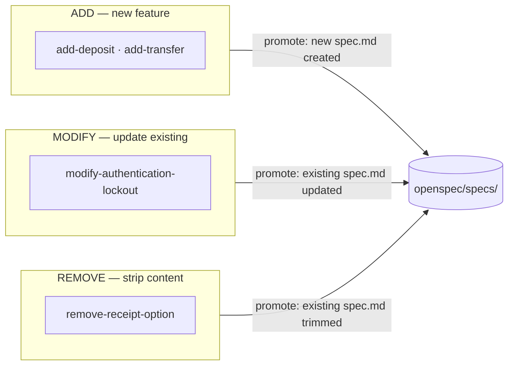
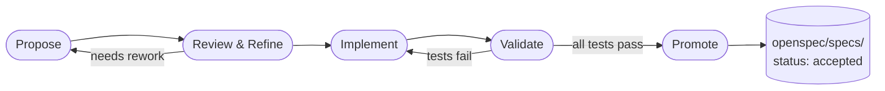
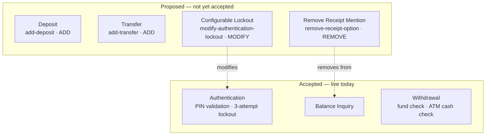
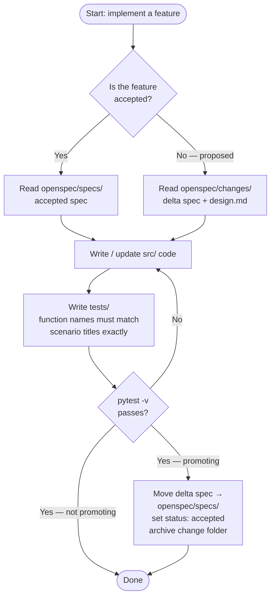
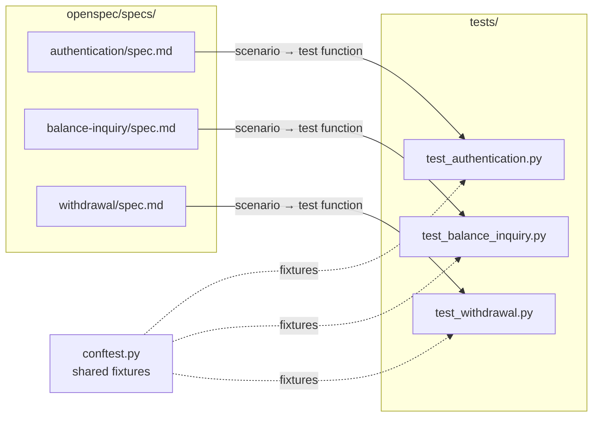
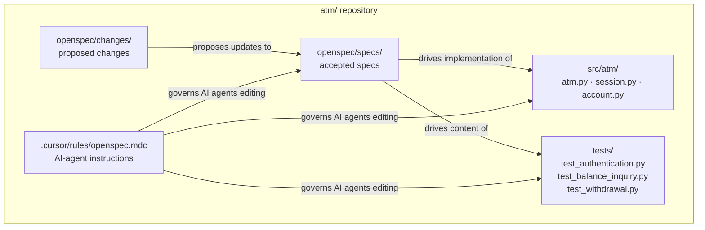

# ATM OpenSpec Demo

A minimal Python project that demonstrates **OpenSpec** concepts using a simple ATM machine
as the domain. The terminal application is intentionally *not* the focus — the goal is to
show how OpenSpec organises specs, changes, delta specs, and scenarios, and how pytest tests
map directly to BDD scenarios.

---

## Table of Contents

1. [What is OpenSpec?](#1-what-is-openspec)
2. [The OpenSpec Workflow](#2-the-openspec-workflow)
3. [How This ATM Project Maps to OpenSpec](#3-how-this-atm-project-maps-to-openspec)
4. [How to Read the Project](#4-how-to-read-the-project)
5. [Example Walkthroughs](#5-example-walkthroughs)
6. [Cursor and AI-Agent Usage](#6-cursor-and-ai-agent-usage)
7. [Testing](#7-testing)
8. [Project Layout](#8-project-layout)
9. [Running the Tests](#9-running-the-tests)

---

## 1. What is OpenSpec?

OpenSpec is a lightweight convention for managing **behavioural specifications** alongside
code. The core idea is simple: specs are the source of truth, and changes to behaviour must
go through a structured proposal process before they touch the codebase.

### Specs as the source of truth

A spec is a Markdown file that describes what a feature does in plain language, using
BDD-style (Given / When / Then) scenarios. Specs live in `openspec/specs/` and have
`status: accepted` in their front matter. Accepted specs are the authoritative description
of how the system behaves right now.

```
openspec/specs/authentication/spec.md   ← what PIN auth does today
openspec/specs/balance-inquiry/spec.md  ← what balance inquiry does today
openspec/specs/withdrawal/spec.md       ← what withdrawal does today
```

If something is in `openspec/specs/`, it is implemented and tested. If it is not in
`openspec/specs/`, the system does not do it.

### Changes as proposed updates

A **change** is a folder under `openspec/changes/` that contains a proposal for modifying
the system. A change is not accepted until it has been reviewed, implemented, and promoted.
Until then, the code in `openspec/specs/` remains the truth.

Each change has a type:

| Type | Meaning |
|------|---------|
| `ADD` | Introduces a brand-new spec (new feature) |
| `MODIFY` | Updates an existing accepted spec |
| `REMOVE` | Deletes or strips content from an existing spec |

The diagram below shows how the three change types in this project flow toward `openspec/specs/`
when promoted.



### Delta specs

A **delta spec** is a spec file inside a change folder:

```
openspec/changes/add-deposit/specs/deposit/spec.md
```

A delta spec is *not* accepted. It describes the new or modified behaviour that the change
would introduce *if* it were accepted. It uses the same BDD format as accepted specs, but
its front matter has `status: proposed`.

For a MODIFY change, the delta spec shows only what is different — not the full spec. See
`openspec/changes/modify-authentication-lockout/specs/authentication/spec.md` for an example.

### Artifacts

Each change folder contains up to four artifact files:

| File | Purpose |
|------|---------|
| `proposal.md` | States what is changing, why, and what is in/out of scope |
| `design.md` | Optional technical design (data structures, method signatures, trade-offs) |
| `tasks.md` | Implementation checklist and promotion steps |
| `specs/<name>/spec.md` | The delta spec |

### Archive / promotion

When a change is accepted:

1. The delta spec is moved (or merged) into `openspec/specs/`.
2. The spec's `status` is updated to `accepted` and the version is bumped.
3. The change folder is archived or removed.

Until that happens, the change folder represents *proposed* work only.

---

## 2. The OpenSpec Workflow

Every behaviour change — whether adding, modifying, or removing a feature — follows the
same five-step lifecycle. The diagram below shows how a proposed change becomes an accepted spec.



### Step 1 — Propose

Someone writes a `proposal.md` describing the change. The proposal states the type
(ADD / MODIFY / REMOVE), the motivation, the scope, and the acceptance criteria.

**ATM example:** `openspec/changes/add-deposit/proposal.md` proposes adding a Cash Deposit
feature. It explains why (users have no way to add funds without a teller), lists what
changes (`ATM.deposit()` method, new test file), and defines what acceptance looks like
(authenticated users can deposit a positive amount, balance increases, transaction recorded).

### Step 2 — Review / refine

The team reviews the proposal, asks questions, and may request changes before any code is
written. During review, a `design.md` is often added to explore the technical approach.

**ATM example:** `openspec/changes/add-deposit/design.md` elaborates on the method
signature and how it mirrors `ATM.withdraw()`.

The delta spec is also written or refined here:
`openspec/changes/add-deposit/specs/deposit/spec.md` shows the exact scenarios the
new feature must satisfy, written in Given/When/Then form before a line of code is touched.

### Step 3 — Implement

With the proposal and delta spec agreed upon, a developer (or AI agent) reads
`tasks.md` to find the implementation checklist and builds the feature. The delta spec
is the implementation contract — every scenario must have a corresponding test.

**ATM example:** `openspec/changes/add-deposit/tasks.md` lists:
- Add `ATM.deposit(amount)` to `src/atm/atm.py`
- Write `tests/test_deposit.py` with one test per scenario in the delta spec
- Update README

### Step 4 — Validate

Run the tests. Every scenario in the delta spec must have a passing test. No scenario
may be implemented without a test, and no test may exist without a corresponding scenario.

```bash
pytest -v
```

### Step 5 — Archive / promote

Once all tasks are done and tests are green, the delta spec is moved to `openspec/specs/`,
the `status` is set to `accepted`, and the change folder is removed or archived.

**ATM example (hypothetical):** After add-deposit is accepted:
```
openspec/changes/add-deposit/specs/deposit/spec.md
  → openspec/specs/deposit/spec.md   (status: accepted, version: 1.0.0)

openspec/changes/add-deposit/   ← archived or deleted
```

---

## 3. How This ATM Project Maps to OpenSpec

### Accepted specs (current truth)

These three specs are accepted. They describe what the ATM does right now, and all have
corresponding implementation and tests.

| Spec | File | What it covers |
|------|------|----------------|
| `authentication` | `openspec/specs/authentication/spec.md` | PIN validation, 3-attempt lockout |
| `balance-inquiry` | `openspec/specs/balance-inquiry/spec.md` | Checking account balance |
| `withdrawal` | `openspec/specs/withdrawal/spec.md` | Withdrawing cash, fund and ATM-cash checks |

### Proposed changes (not yet accepted)

These four changes are in progress. None of them affect `openspec/specs/` until they are
accepted and promoted.

| Change | Type | What it proposes |
|--------|------|-----------------|
| `add-deposit` | ADD | New Cash Deposit feature — `ATM.deposit()`, new spec, new tests |
| `add-transfer` | ADD | New Fund Transfer feature — account-to-account transfers |
| `modify-authentication-lockout` | MODIFY | Make lockout threshold configurable instead of hard-coded at 3 |
| `remove-receipt-option` | REMOVE | Strip unused receipt mention from the balance-inquiry spec |

The diagram below shows every ATM feature — solid boxes are live today, dashed boxes are
proposed. Arrows show which proposed changes affect which existing specs.



---

## 4. How to Read the Project

### Where to start

1. Read `openspec/openspec.json` — one glance at the project name, specs dir, and changes dir.
2. Read an accepted spec in `openspec/specs/`, such as `openspec/specs/authentication/spec.md`.
   Notice the YAML front matter (`status: accepted`) and the Given/When/Then scenarios.
3. Open `tests/test_authentication.py` and compare the test function names to the scenario
   titles. They are intentionally identical.

### What to inspect next

- Skim the four change folders under `openspec/changes/`. Read each `proposal.md` to
  understand what is being proposed and why.
- For `add-deposit` and `modify-authentication-lockout`, also read `design.md` — these
  changes needed technical discussion before implementation.
- Read the delta specs under `openspec/changes/*/specs/`. Notice how ADD delta specs are
  full specs, while the MODIFY delta spec shows only the changed or new scenarios.

### How tests map to scenarios

Test function names are written to match spec scenario titles exactly (with spaces replaced
by underscores and lowercased). This makes the mapping auditable without running any tool.

```
Scenario title in spec.md
  "Scenario: Account locked after three consecutive failed PIN attempts"

Test function in test_authentication.py
  test_account_locked_after_three_consecutive_failed_pin_attempts
```

### How a developer or agent should use specs before editing code

1. **Check `openspec/specs/`** for the accepted spec that covers the feature you are
   touching. Read the scenarios — those define the required behaviour.
2. **Check `openspec/changes/`** if you are implementing a proposed feature. The delta spec
   and `design.md` in the change folder are your implementation contract.
3. **Never implement something from `openspec/changes/` into production code without first
   promoting it to `openspec/specs/`** — unless the task explicitly says it is in-progress
   and unapproved work.
4. Every scenario you implement must have a corresponding test, and vice versa.

---

## 5. Example Walkthroughs

### Adding Deposit — an ADD change

The `add-deposit` change introduces a brand-new feature with no prior spec.

**The artifacts tell the story:**

- `proposal.md` — why: users need a way to add funds; scope: new `ATM.deposit()` method,
  new `tests/test_deposit.py`.
- `design.md` — how: method signature mirrors `ATM.withdraw()`, ATM cash level increases.
- `specs/deposit/spec.md` — the delta spec with three scenarios (successful deposit, zero/
  negative amount rejected, unauthenticated user blocked).
- `tasks.md` — implementation checklist ending with promotion steps.

**To implement it:**
1. Read the delta spec scenarios.
2. Write `ATM.deposit(amount: float) -> float` in `src/atm/atm.py`.
3. Write `tests/test_deposit.py` with one test per scenario, named to match the scenario title.
4. Run `pytest -v` — all new tests plus all existing tests must be green.
5. Move the delta spec to `openspec/specs/deposit/spec.md`, set `status: accepted`,
   bump the version to `1.0.0`, and archive the change folder.

### Modifying Authentication Lockout — a MODIFY change

The `modify-authentication-lockout` change updates an *existing* accepted spec. It does
not replace the whole spec — only the affected scenarios change.

**Key difference from ADD:** The delta spec at
`openspec/changes/modify-authentication-lockout/specs/authentication/spec.md` lists only
the modified and new scenarios, not the full spec. It explicitly states what it replaces
from `v1.0.0`.

**To implement it:**
1. Read the delta spec — it replaces one scenario ("Account locked after three consecutive…")
   and adds two new ones ("Custom lockout threshold is respected", "Default lockout threshold
   is 3").
2. Update `src/atm/session.py` to accept a `max_attempts` parameter instead of using the
   hard-coded constant.
3. Update `src/atm/atm.py` to pass `max_pin_attempts` to `Session` on `insert_card()`.
4. Update `tests/test_authentication.py` — rename the replaced scenario's test and add
   tests for the two new scenarios.
5. On promotion: merge the delta scenarios into `openspec/specs/authentication/spec.md`,
   bump the version to `1.1.0`, archive the change folder.

### Removing Receipt Option — a REMOVE change

The `remove-receipt-option` change strips content from an existing spec. The receipt
concept was a placeholder with no implementation.

**Key difference:** The delta spec at
`openspec/changes/remove-receipt-option/specs/balance-inquiry/spec.md` shows the spec as it
would look *after* the removal — clean, with no receipt references.

**To implement it:**
1. The proposal confirms there is no code to delete — the receipt was never implemented.
2. Edit `openspec/specs/balance-inquiry/spec.md` — remove the receipt mention from the
   Overview paragraph and any receipt-related scenario.
3. Bump the spec version to `1.1.0`.
4. Confirm no test references a receipt code path (none exist).
5. Archive the change folder — no source code changes required.

---

## 6. Cursor and AI-Agent Usage

The file `.cursor/rules/openspec.mdc` is loaded by Cursor for every file matching
`openspec/**/*.md`, `src/**/*.py`, or `tests/**/*.py`. It instructs the editor (and any
AI agent operating in it) to:

- Treat `openspec/specs/*/spec.md` as the authoritative description of current behaviour.
- Treat `openspec/changes/*/` as proposed work — not yet accepted, not yet implemented.
- Mirror test function names to scenario titles exactly.
- Not add a scenario without a test, and not add a test without a scenario.
- On promotion, move the delta spec to `openspec/specs/` and archive the change folder.

**For any AI agent (Cursor, Claude Code, etc.):**

- Before generating code for a feature, read the accepted spec for that feature first.
- Before generating code for a proposed feature, read the change's delta spec and `design.md`.
- Do not implement anything from `openspec/changes/` directly into `openspec/specs/` —
  that promotion step requires explicit instruction.
- When writing tests, derive the function names from the scenario titles in the spec, not
  from the function names in the source.

The diagram below shows the decision process an agent should follow before writing any code.



---

## 7. Testing

Tests live in `tests/` and map one-to-one to the accepted specs in `openspec/specs/`.

| Test file | Corresponding spec |
|-----------|-------------------|
| `tests/test_authentication.py` | `openspec/specs/authentication/spec.md` |
| `tests/test_balance_inquiry.py` | `openspec/specs/balance-inquiry/spec.md` |
| `tests/test_withdrawal.py` | `openspec/specs/withdrawal/spec.md` |

The diagram below shows how accepted specs drive the test files, and how `conftest.py`
supplies shared fixtures to all of them.



Each test function corresponds to exactly one scenario. The mapping is explicit: the
function name is the scenario title in snake_case.

```python
# In tests/test_authentication.py:

def test_account_locked_after_three_consecutive_failed_pin_attempts(atm):
    ...

# Corresponds to in openspec/specs/authentication/spec.md:

# ### Scenario: Account locked after three consecutive failed PIN attempts
```

`tests/conftest.py` provides shared pytest fixtures (an `atm` instance pre-loaded with
test accounts) used across all test files.

Proposed changes do not yet have test files — those are written as part of the
implementation step for the change.

---

## 8. Project Layout

```
atm/
├── pyproject.toml
├── README.md
├── .cursor/
│   └── rules/
│       └── openspec.mdc          # Cursor / AI-agent rules for this project
├── src/
│   └── atm/
│       ├── account.py            # Account and Transaction data classes
│       ├── atm.py                # ATM domain logic and error types
│       ├── session.py            # Per-session PIN validation and lockout
│       └── main.py               # Terminal UI (not the focus)
├── tests/
│   ├── conftest.py               # shared pytest fixtures
│   ├── test_authentication.py    # scenarios from authentication spec
│   ├── test_balance_inquiry.py   # scenarios from balance-inquiry spec
│   └── test_withdrawal.py        # scenarios from withdrawal spec
└── openspec/
    ├── openspec.json             # project configuration
    ├── specs/                    # accepted / current specs
    │   ├── authentication/spec.md
    │   ├── balance-inquiry/spec.md
    │   └── withdrawal/spec.md
    └── changes/                  # proposed changes (not yet accepted)
        ├── add-deposit/
        │   ├── proposal.md
        │   ├── design.md
        │   ├── tasks.md
        │   └── specs/deposit/spec.md
        ├── add-transfer/
        │   ├── proposal.md
        │   ├── tasks.md
        │   └── specs/transfer/spec.md
        ├── modify-authentication-lockout/
        │   ├── proposal.md
        │   ├── design.md
        │   ├── tasks.md
        │   └── specs/authentication/spec.md
        └── remove-receipt-option/
            ├── proposal.md
            ├── tasks.md
            └── specs/balance-inquiry/spec.md
```

The diagram below shows the key relationships between directories — how specs drive both
source code and tests, and how the Cursor rules govern AI-agent behaviour across the repo.



---

## 9. Running the Tests

```bash
# install dev dependencies
pip install -e ".[dev]"

# run all tests
pytest

# verbose output shows scenario names alongside test results
pytest -v
```

The terminal app (`src/atm/main.py`) exists for manual exploration but is not the intended
way to verify behaviour. Use the tests — they are faster, repeatable, and directly tied to
the specs.

```bash
python -m atm.main
```
