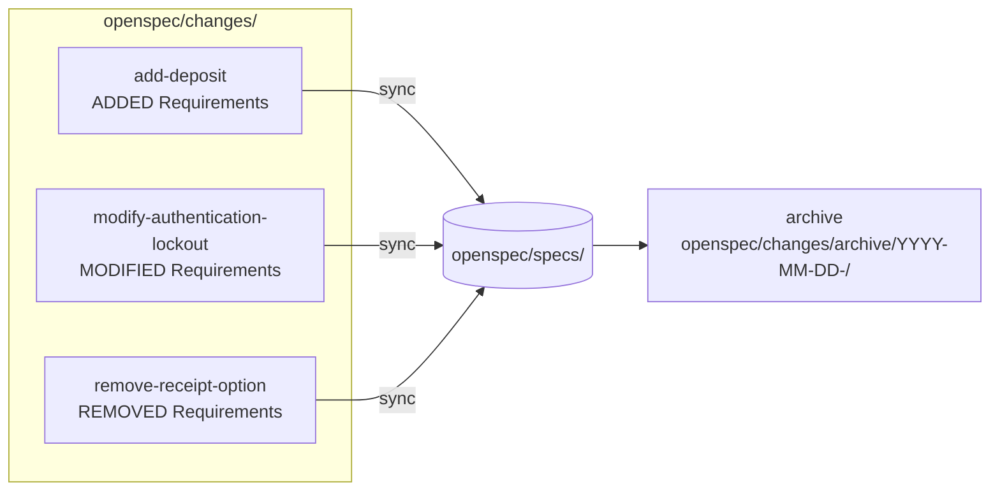
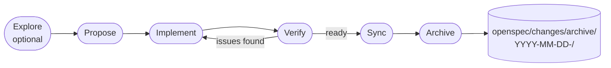
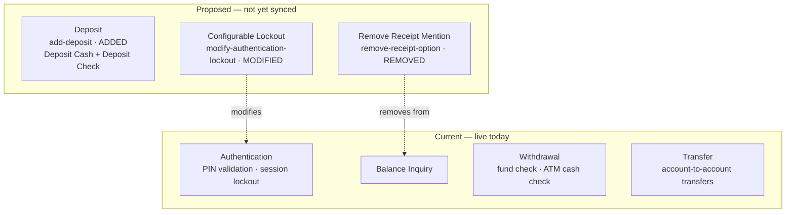
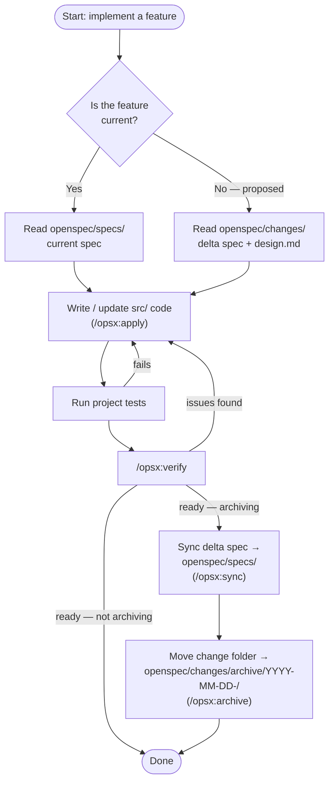
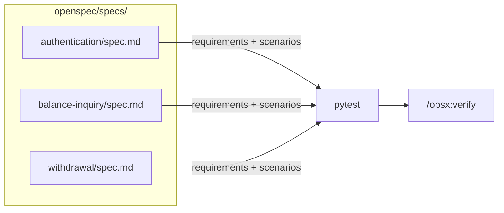
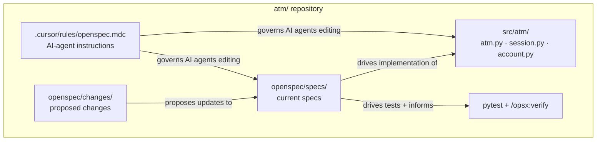

# ATM OpenSpec Demo

A minimal Python project that demonstrates **OpenSpec** concepts using a simple ATM machine
as the domain. The terminal application is intentionally *not* the focus — the goal is to
show how OpenSpec organises specs, changes, delta specs, and scenarios, and how specifications
drive both implementation and verification.


## Introductory Video

<video src="assets/intro-video.mp4" controls width="720"></video>

If your Markdown viewer does not render the player, [open the intro video](assets/intro-video.mp4)
(note: GitHub may download the MP4 instead of streaming it).

---

## Table of Contents

1. [What is OpenSpec?](#1-what-is-openspec)
2. [The OpenSpec Workflow](#2-the-openspec-workflow)
3. [How This ATM Project Maps to OpenSpec](#3-how-this-atm-project-maps-to-openspec)
4. [How to Read the Project](#4-how-to-read-the-project)
5. [Example Walkthroughs](#5-example-walkthroughs)
6. [Cursor and AI-Agent Usage](#6-cursor-and-ai-agent-usage)
7. [Verification](#7-verification)
8. [Project Layout](#8-project-layout)

---

## 1. What is OpenSpec?

Official docs: <https://github.com/Fission-AI/OpenSpec>

OpenSpec is a lightweight convention for managing **behavioural specifications** alongside
code. The core idea is simple:

> **Spec = WHAT**
> The system does
>
> **Proposal = WHY**
> The system should change
>
> **Design = HOW**
> The change will be implemented

Specs are the source of truth. Changes to behaviour must go through a structured proposal
process before they touch the codebase.

### Specs as the source of truth

A spec describes what a feature does in plain language, using GIVEN / WHEN / THEN scenarios.
Specs live in `openspec/specs/` and are the authoritative description of how the system
behaves right now.

A spec can contain **multiple requirements**, and each requirement can have **multiple
scenarios**. For example, the deposit spec (from the `add-deposit` change) contains two
requirements — **Deposit Cash** and **Deposit Check** — each with its own set of scenarios.
This makes it clear that one spec can specify several related but distinct behaviours.

```
openspec/specs/authentication/spec.md   ← what PIN auth does today
openspec/specs/balance-inquiry/spec.md  ← what balance inquiry does today
openspec/specs/withdrawal/spec.md       ← what withdrawal does today
```

If something is in `openspec/specs/`, it is implemented and verified. If it is not in
`openspec/specs/`, treat it as proposed or out of scope until its delta has been synced.

### Spec format

Specs follow a simple, consistent structure:

```
# Feature Specification

## Purpose
One-sentence description of the feature.

## Requirements

### Requirement: Name of Requirement
The system SHALL / MUST ...

#### Scenario: Name of Scenario
- GIVEN precondition
- WHEN action
- THEN outcome
- AND additional outcome
```

Each **Requirement** states a binding rule. Each **Scenario** under it illustrates a
specific case with GIVEN / WHEN / THEN / AND steps. One spec, many requirements. One
requirement, many scenarios.

### Changes as proposed updates

A **change** is a folder under `openspec/changes/` that contains a proposal for modifying
the system. A change is not part of the current spec set until its deltas are synced into
`openspec/specs/` and the change folder is archived. Until then, `openspec/specs/` remains
the source of truth.

Delta specs use three section labels:

| Delta section | Meaning |
|---------------|---------|
| `## ADDED Requirements` | New requirements or scenarios to add |
| `## MODIFIED Requirements` | Existing requirements or scenarios to revise |
| `## REMOVED Requirements` | Existing requirements or scenarios to remove |

These are section headings inside a delta spec, not mutually exclusive labels. A
single delta spec can contain ADDED, MODIFIED, and REMOVED sections at the same time.
This project names each example change after its dominant operation as a local convention;
OpenSpec does not require that naming pattern.

| Change | Dominant delta section | What it proposes |
|--------|------------------------|-----------------|
| `add-deposit` | ADDED | Deposit requirements and scenarios |
| `modify-authentication-lockout` | MODIFIED | Configurable lockout threshold instead of hard-coded 3 |
| `remove-receipt-option` | REMOVED | Strip unused receipt mention from balance inquiry |

The diagram below shows how the example changes eventually sync deltas into
`openspec/specs/` and then move to the archive.


```mermaid
flowchart LR
    subgraph changes ["openspec/changes/"]
        a["add-deposit\nADDED Requirements"]
        m["modify-authentication-lockout\nMODIFIED Requirements"]
        r["remove-receipt-option\nREMOVED Requirements"]
    end

    a -->|"sync"| specs
    m -->|"sync"| specs
    r -->|"sync"| specs

    specs[(openspec/specs/)] --> archive["archive\nopenspec/changes/archive/YYYY-MM-DD-<name>/"]
```

### Delta specs

A **delta spec** is a spec file inside a change folder:

```
openspec/changes/add-deposit/specs/deposit/spec.md
```

A delta spec is not current truth yet. It describes what would change if synced into
`openspec/specs/`. Brand-new requirements go under `## ADDED Requirements`; revisions go
under `## MODIFIED Requirements`; removals go under `## REMOVED Requirements`.

### Artifacts

Each change folder contains up to four artifact files:

| File | Purpose |
|------|---------|
| `proposal.md` | **WHY**: what is changing, motivation, and scope |
| `design.md` | **HOW**: optional technical approach, architecture decisions, data flow |
| `tasks.md` | Implementation checklist and archive steps |
| `specs/<name>/spec.md` | The delta spec — **WHAT** the change introduces |

### Sync and archive

When a change is complete:

1. Syncing merges the delta spec into `openspec/specs/`.
2. Archiving moves the change folder to `openspec/changes/archive/YYYY-MM-DD-<name>/`.

The archive workflow offers to sync first if the deltas have not already been merged.
Archiving preserves the change folder for audit history.

Until then, the change folder represents *proposed* work only.

---

## 2. The OpenSpec Workflow

Every behaviour change follows the same lifecycle: explore when needed, propose artifacts,
implement tasks, verify the result, sync deltas, and archive the change.

> **Quick reference — OpenSpec commands:**
>
> **Core profile** (default):
> - `/opsx:explore` — clarify requirements and investigate options before creating a change; creates no artifacts
> - `/opsx:propose` — create a change and generate planning artifacts in one step: `proposal.md`, specs, `design.md`, and `tasks.md`
> - `/opsx:apply` — implement tasks from the change
> - `/opsx:sync` — merge delta specs into `openspec/specs/` without archiving yet
> - `/opsx:archive` — archive a completed change; offers to sync first if needed
>
> **Expanded workflow** (enable with `openspec config profile` → workflows, then `openspec update`):
> - `/opsx:verify` — inspect implementation evidence across Completeness, Correctness, and Coherence
> - `/opsx:new`, `/opsx:continue`, `/opsx:ff`, `/opsx:bulk-archive`, `/opsx:onboard` — additional workflow controls


```mermaid
flowchart LR
    E([Explore\noptional]) --> P([Propose])
    P --> I([Implement])
    I --> V([Verify])
    V -->|issues found| I
    V -->|ready| S([Sync])
    S --> A([Archive])
    A --> O[(openspec/changes/archive/\nYYYY-MM-DD-<name>/)]
```

### Step 1 — Propose `/opsx:propose` (optionally preceded by `/opsx:explore`)

Before proposing, you can run `/opsx:explore` to have a focused conversation about
requirements and tradeoffs. `/opsx:explore` creates no artifacts and is most useful when
the scope or approach is still unclear.

Once ready, use `/opsx:propose` to create the full planning set in one step: `proposal.md`,
delta specs, `design.md`, and `tasks.md`.

**ATM example:** `openspec/changes/add-deposit/` contains:
- `proposal.md` — why deposit matters and what is in scope
- `specs/deposit/spec.md` — the Deposit Cash and Deposit Check requirements and scenarios
- `design.md` — the two-method approach (`deposit_cash`, `deposit_check`)
- `tasks.md` — implementation checklist

Review and edit the generated artifacts before moving to implementation — adjust the
proposal, delta spec, design, or tasks if the scope or approach needs refinement.

### Step 2 — Implement

The developer reads `tasks.md` and the delta spec (`specs/<name>/spec.md`). The delta spec
is the implementation contract — every scenario should end up with corresponding behaviour
and tests. Tasks can be completed in any of three ways:

1. **Manually** — code each task by hand.
2. **Step by step with an LLM pair-programmer** (e.g. Claude Code, Cursor) — work through
   `tasks.md` one task at a time, reviewing each diff before moving on.
3. **`/opsx:apply`** (optional) — hand the entire `tasks.md` to the agent and let it work
   through the list end-to-end; most useful for small, well-scoped changes.

**ATM example:** `openspec/changes/add-deposit/tasks.md` lists:
- Add `ATM.deposit_cash(amount)` and `ATM.deposit_check(amount)` to `src/atm/atm.py`
- Write `tests/test_deposit.py` covering every scenario in the delta spec
- Update README

### Step 3 — Verify `/opsx:verify`

Use `/opsx:verify <change-name>` to have the AI inspect the codebase for evidence that
the implementation matches the change artifacts. Its **Completeness** check looks for
implemented requirements and scenario test coverage.

```text
/opsx:verify add-deposit
```

This is an agent-based review, not a deterministic CLI gate. It reports issues as
CRITICAL, WARNING, or SUGGESTION and does not block archive by itself. `/opsx:verify` is
part of the expanded workflow.

### Step 4 — Sync and archive `/opsx:sync` + `/opsx:archive`

Once all tasks are done, tests pass, and verification issues are addressed, sync the delta
spec into `openspec/specs/` and archive the change.

**ATM example (hypothetical):** After `add-deposit` is complete:

```
/opsx:sync add-deposit
  merges openspec/changes/add-deposit/specs/deposit/spec.md
  into openspec/specs/deposit/spec.md

/opsx:archive add-deposit
  moves openspec/changes/add-deposit/
  to openspec/changes/archive/YYYY-MM-DD-<name>/
```

`/opsx:archive` offers to sync first if needed, so quick changes can go straight to archive.

---

## 3. How This ATM Project Maps to OpenSpec

### Current specs (source of truth)

These four specs describe what the ATM does right now.

| Spec | File | What it covers |
|------|------|----------------|
| `authentication` | `openspec/specs/authentication/spec.md` | PIN validation, session lockout |
| `balance-inquiry` | `openspec/specs/balance-inquiry/spec.md` | Checking account balance |
| `withdrawal` | `openspec/specs/withdrawal/spec.md` | Withdrawing cash, fund and ATM-cash checks |
| `transfer` | `openspec/specs/transfer/spec.md` | Account-to-account transfers within the ATM system |

### Proposed changes (not yet synced)

These three changes are in progress. None of them affect `openspec/specs/` until their
deltas are synced and the change is archived.

| Change | Dominant delta section | What it proposes |
|--------|------------------------|-----------------|
| `add-deposit` | ADDED | Deposit Cash and Deposit Check requirements and tests |
| `modify-authentication-lockout` | MODIFIED | Make lockout threshold configurable instead of hard-coded at 3 |
| `remove-receipt-option` | REMOVED | Strip unused receipt mention from the balance-inquiry spec |

The `add-deposit` change is a good illustration of a spec with **multiple requirements**:
the deposit spec covers both **Deposit Cash** and **Deposit Check**, each with its own
scenarios. One spec, two requirements, multiple scenarios each.

The diagram below shows every ATM feature — solid boxes are live today, dashed boxes are
proposed. Arrows show which proposed changes affect which existing specs.


```mermaid
flowchart TD
    subgraph live ["Current — live today"]
        A[Authentication\nPIN validation · session lockout]
        B[Balance Inquiry]
        C[Withdrawal\nfund check · ATM cash check]
        E[Transfer\naccount-to-account transfers]
    end

    subgraph pending ["Proposed — not yet synced"]
        D[Deposit\nadd-deposit · ADDED\nDeposit Cash + Deposit Check]
        F[Configurable Lockout\nmodify-authentication-lockout · MODIFIED]
        G[Remove Receipt Mention\nremove-receipt-option · REMOVED]
    end

    F -. modifies .-> A
    G -. removes from .-> B
```

---

## 4. How to Read the Project

### Where to start

1. Read `openspec/openspec.json` — one glance at the project name, specs dir, and changes dir.
2. Read a current spec in `openspec/specs/`, such as `openspec/specs/authentication/spec.md`.
   Notice the **Purpose**, **Requirements**, and GIVEN/WHEN/THEN **Scenarios** structure.
3. Compare the scenario names in the spec to the function names in `tests/test_authentication.py`.
   They are intentionally identical (spaces replaced with underscores, lowercased).

### What to inspect next

- Skim the four change folders under `openspec/changes/`. Read each `proposal.md` to
  understand **why** (**WHY**) each change is being made.
- For `add-deposit` and `modify-authentication-lockout`, also read `design.md` — these
  changes needed technical discussion (**HOW**) before implementation.
- Read the delta specs under `openspec/changes/*/specs/`. Each can use the same delta
  sections: `## ADDED Requirements`, `## MODIFIED Requirements`, and `## REMOVED Requirements`.
- Notice the `add-deposit` delta spec: it has two requirements — **Deposit Cash** and
  **Deposit Check** — each with multiple scenarios. This illustrates that one spec can
  describe several related behaviours, not just one.

### Spec format at a glance

```
# Feature Specification

## Purpose
One-sentence description.

## Requirements

### Requirement: Descriptive Name
The system SHALL ...

#### Scenario: Descriptive Name
- GIVEN precondition
- WHEN action
- THEN outcome
- AND additional outcome
```

Each **Requirement** is a binding rule (using SHALL / MUST / SHOULD). Each **Scenario**
under it is a concrete GIVEN/WHEN/THEN example. A spec may contain any number of
requirements, and each requirement may have any number of scenarios.

### How scenarios map to verification

Scenario titles in a spec serve as the canonical name for a behaviour. During
`/opsx:verify`, the AI checks whether scenarios have implementation evidence and test
coverage. In this project, scenarios are also mirrored as test function names
(snake_case); that naming convention is not an OpenSpec tooling rule:

```
Scenario title in spec.md:
  "Scenario: Account locked after three consecutive failed PIN attempts"

Test function in test_authentication.py:
  test_account_locked_after_three_consecutive_failed_pin_attempts
```

### How a developer or agent should use specs before editing code

1. **Check `openspec/specs/`** for the current spec that covers the feature you are
   touching. Read the requirements and scenarios — those define the required behaviour.
2. **Check `openspec/changes/`** if you are implementing a proposed feature. The delta spec
   and `design.md` in the change folder are your implementation contract.
3. **Do not treat something from `openspec/changes/` as current behaviour until its delta
   is synced into `openspec/specs/`** — unless the task explicitly says it is in-progress
   and unapproved work.
4. Every scenario you implement must be traceable to code and tests.

---

## 5. Example Walkthroughs

### Adding Deposit — an ADDED delta example

The `add-deposit` change introduces brand-new requirements under `## ADDED Requirements`.

**The artifacts tell the story (WHAT / WHY / HOW):**

- `proposal.md` — **WHY**: users need a way to add funds; scope includes cash and cheque
  deposit methods, a new spec, and a new test file.
- `design.md` — **HOW**: two separate methods (`deposit_cash`, `deposit_check`) mirror
  `ATM.withdraw()`, with explicit side-effect differences for each deposit type.
- `specs/deposit/spec.md` — **WHAT**: the delta spec with two requirements (Deposit Cash,
  Deposit Check), each with multiple scenarios covering success, rejection, and access control.
- `tasks.md` — implementation checklist ending with archive steps.

**Workflow commands:**
- `/opsx:propose` — creates `proposal.md`, the delta spec, `design.md`, and `tasks.md`.
- `/opsx:explore` — optional pre-proposal investigation if requirements are unclear.
- `/opsx:apply` — implements `ATM.deposit_cash()` and `ATM.deposit_check()` according to
  the delta spec scenarios.
- `/opsx:sync` — merges the deposit delta into `openspec/specs/deposit/spec.md`.
- `/opsx:archive` — moves the change folder to `openspec/changes/archive/YYYY-MM-DD-<name>/`.

**To implement it:**
1. Read the delta spec requirements and scenarios (two requirements, multiple scenarios each).
2. Write `ATM.deposit_cash(amount: float) -> float` and `ATM.deposit_check(amount: float) -> float`
   in `src/atm/atm.py`.
3. Write `tests/test_deposit.py` with tests covering every scenario in the delta spec.
4. Run the test suite, then use `/opsx:verify add-deposit` to check scenario coverage.
5. Sync the delta spec into `openspec/specs/deposit/spec.md`, then archive the change folder.

### Modifying Authentication Lockout — a MODIFIED delta example

The `modify-authentication-lockout` change updates an existing current spec. It does
not replace the whole spec — only the affected requirement changes.

**Key point:** The delta spec at
`openspec/changes/modify-authentication-lockout/specs/authentication/spec.md` uses
`## MODIFIED Requirements` to show the behaviour being revised.

**The artifacts (WHAT / WHY / HOW):**
- `proposal.md` — **WHY**: security teams need per-ATM lockout policies without code changes.
- `design.md` — **HOW**: `ATM` accepts `max_pin_attempts` and forwards it to `Session`.
- `specs/authentication/spec.md` — **WHAT**: the modified Account Lockout requirement with
  three scenarios (configurable threshold, custom threshold respected, default is 3).

**Workflow commands:**
- `/opsx:propose` — creates the proposal, delta spec, design, and task list.
- `/opsx:apply` — updates `session.py` and `atm.py` per the design.
- `/opsx:sync` — merges the delta scenarios into `openspec/specs/authentication/spec.md`.
- `/opsx:archive` — preserves the completed change under `openspec/changes/archive/YYYY-MM-DD-<name>/`.

**To implement it:**
1. Read the delta spec — it modifies the Account Lockout requirement with three scenarios.
2. Update `src/atm/session.py` to accept a `max_attempts` parameter instead of the constant.
3. Update `src/atm/atm.py` to pass `max_pin_attempts` to `Session` on `insert_card()`.
4. Add the new scenario tests to `tests/test_authentication.py`.
5. Run the test suite, then use `/opsx:verify modify-authentication-lockout` to check scenario coverage.
6. Sync the delta scenarios into `openspec/specs/authentication/spec.md`, then archive the change folder.

### Removing Receipt Option — a REMOVED delta example

The `remove-receipt-option` change strips content from an existing spec. The receipt
concept was a placeholder with no implementation.

**Key point:** The delta spec uses `## REMOVED Requirements` to show what is being
stripped. No new scenarios or implementation are involved.

**The artifacts (WHAT / WHY / HOW):**
- `proposal.md` — **WHY**: the receipt placeholder confuses implementers; it was never built.
- `specs/balance-inquiry/spec.md` — **WHAT**: a REMOVED Requirements delta, noting the
  deprecated Receipt Acknowledgement requirement.
- No `design.md` — this REMOVED-only delta needs no technical design because there are no code changes.

**To implement it:**
1. The proposal confirms there is no code to delete — the receipt was never implemented.
2. Edit `openspec/specs/balance-inquiry/spec.md` — remove the receipt mention from the Overview.
3. Use `/opsx:verify remove-receipt-option` to check that the spec cleanup matches the codebase.
4. Sync the delta into `openspec/specs/balance-inquiry/spec.md`, then archive the change folder.

---

## 6. Cursor and AI-Agent Usage

The file `.cursor/rules/openspec.mdc` is loaded by Cursor for every file matching
`openspec/**/*.md`, `src/**/*.py`, or `tests/**/*.py`. It instructs the editor (and any
AI agent operating in it) to:

- Treat `openspec/specs/*/spec.md` as the authoritative description of current behaviour.
- Treat `openspec/changes/*/` as proposed work — not yet synced, not yet implemented.
- Mirror scenario titles to implementation and test function names exactly.
- Not add a scenario without corresponding implementation, and vice versa.
- When ready, sync the delta spec into `openspec/specs/` and archive the change folder.

**For any AI agent (Cursor, Claude Code, etc.):**

- Before generating code for a feature, read the current spec for that feature first.
- Before generating code for a proposed feature, read the change's delta spec and `design.md`.
- Do not implement anything from `openspec/changes/` directly into `openspec/specs/` —
  that archive step requires explicit instruction (or `/opsx:archive`).
- Use the OpenSpec commands as entry points:
  - `/opsx:explore` — optional pre-proposal investigation; creates no artifacts
  - `/opsx:propose` — create proposal, specs, design, and tasks (**WHY** + **WHAT** + **HOW**)
  - `/opsx:apply` — implement according to spec
  - `/opsx:sync` — merge deltas into `openspec/specs/`
  - `/opsx:verify` — inspect implementation evidence against artifacts (expanded workflow)
  - `/opsx:archive` — archive the completed change

The diagram below shows the decision process an agent should follow before writing any code.


```mermaid
flowchart TD
    Start([Start: implement a feature]) --> Q1{Is the feature\ncurrent?}
    Q1 -->|Yes| RS["Read openspec/specs/\ncurrent spec"]
    Q1 -->|No — proposed| RC["Read openspec/changes/\ndelta spec + design.md"]
    RS --> Impl["Write / update src/ code\n(/opsx:apply)"]
    RC --> Impl
    Impl --> T["Run project tests"]
    T -->|fails| Impl
    T --> V["/opsx:verify <change-name>"]
    V -->|issues found| Impl
    V -->|"ready — archiving"| Sync["Sync delta spec →\nopenspec/specs/\n(/opsx:sync)"]
    Sync --> Arch["Move change folder →\nopenspec/changes/archive/YYYY-MM-DD-<name>/\n(/opsx:archive)"]
    V -->|"ready — not archiving"| Done([Done])
    Arch --> Done
```

---

## 7. Verification

OpenSpec separates structural validation from implementation verification:

- `openspec validate` checks OpenSpec artifacts for structural issues.
- `/opsx:verify <change-name>` asks the AI agent to inspect implementation evidence across
  Completeness, Correctness, and Coherence.

For this project, scenarios in current specs define what must be implemented. This repo
uses an explicit local convention: scenario titles correspond to snake_case test function
names. OpenSpec tooling does not require that naming convention, but `/opsx:verify` can
review whether scenarios have matching code and tests. Verification is advisory rather
than a hard archive gate.

The diagram below shows how current specs drive tests and verification across the ATM features.


```mermaid
flowchart LR
    subgraph specs ["openspec/specs/"]
        s1[authentication/spec.md]
        s2[balance-inquiry/spec.md]
        s3[withdrawal/spec.md]
    end

    T["pytest"]
    V["/opsx:verify"]

    s1 -->|"requirements + scenarios"| T
    s2 -->|"requirements + scenarios"| T
    s3 -->|"requirements + scenarios"| T
    T --> V
```

Proposed changes do not yet have full implementation coverage — those are tested and
verified as part of the implementation step for each change, before archiving.

---

## 8. Project Layout

```
atm/
├── pyproject.toml
├── README.md
├── .cursor/
│   └── rules/
│       └── openspec.mdc          # Cursor / AI-agent rules for this project
├── src/
│   └── atm/
│       ├── account.py            # Account and Transaction data classes
│       ├── atm.py                # ATM domain logic and error types
│       ├── session.py            # Per-session PIN validation and lockout
│       └── main.py               # Terminal UI (not the focus)
├── tests/
│   ├── conftest.py               # shared test fixtures
│   ├── test_authentication.py    # scenarios from authentication spec
│   ├── test_balance_inquiry.py   # scenarios from balance-inquiry spec
│   └── test_withdrawal.py        # scenarios from withdrawal spec
└── openspec/
    ├── openspec.json             # project configuration
    ├── specs/                    # current specs
    │   ├── authentication/spec.md
    │   ├── balance-inquiry/spec.md
    │   ├── withdrawal/spec.md
    │   └── transfer/spec.md
    └── changes/                  # proposed changes (not yet synced)
        ├── add-deposit/
        │   ├── proposal.md       # WHY: motivation and scope
        │   ├── design.md         # HOW: technical approach and decisions
        │   ├── tasks.md
        │   └── specs/deposit/spec.md   # WHAT: Deposit Cash + Deposit Check requirements
        ├── archive/2026-04-27-add-transfer/
        │   ├── proposal.md       # archived WHY
        │   ├── tasks.md
        │   └── specs/transfer/spec.md  # archived delta WHAT
        ├── modify-authentication-lockout/
        │   ├── proposal.md       # WHY
        │   ├── design.md         # HOW
        │   ├── tasks.md
        │   └── specs/authentication/spec.md  # WHAT: MODIFIED Requirements
        └── remove-receipt-option/
            ├── proposal.md       # WHY
            ├── tasks.md
            └── specs/balance-inquiry/spec.md  # WHAT: REMOVED Requirements
```

The diagram below shows the key relationships between directories — how specs drive both
source code and verification, and how the Cursor rules govern AI-agent behaviour across the repo.


```mermaid
flowchart TD
    subgraph repo ["atm/ repository"]
        specs["openspec/specs/\ncurrent specs"]
        changes["openspec/changes/\nproposed changes"]
        src["src/atm/\natm.py · session.py · account.py"]
        valid["pytest + /opsx:verify"]
        rules[".cursor/rules/openspec.mdc\nAI-agent instructions"]
    end

    specs -->|"drives implementation of"| src
    specs -->|"drives tests + informs"| valid
    changes -->|"proposes updates to"| specs
    rules -->|"governs AI agents editing"| src
    rules -->|"governs AI agents editing"| specs
```
